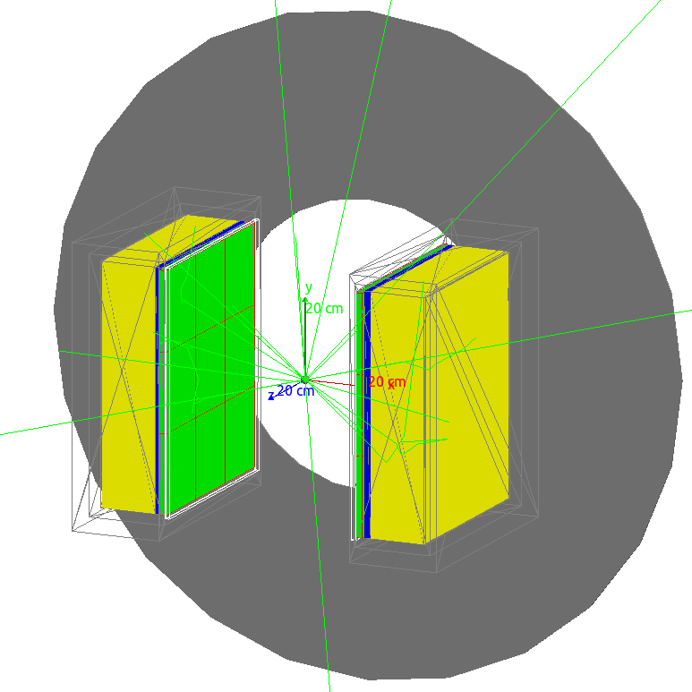

.. ForteModel documentation master file, created by
   sphinx-quickstart on Tue Jul 19 11:08:16 2022.
   You can adapt this file completely to your liking, but it should at least
   contain the root `toctree` directive.

Welcome to ForteModel's documentation!
======================================

**ForteModel** is a repository for simulation scripts created with the Geant4 
Application for Tomographic Emission (GATE) to be used with a model of the
Phillips/ADAC Forte dual headed positron camera.

GATE is a Monte Carlo radiation transport and detector simulation software. A 
model of Forte detectior has been created using GATE and validated by experiments
a the University of Birmingham's Positron Imaging Centre. The objective of this 
repository is create a single place where simulation scripts can be catalogued, 
described, and made available to the public and other researchers.

.. toctree::
   :maxdepth: 2
   :caption: Contents:

Indices and tables
==================

* :ref:`genindex`
* :ref:`modindex`
* :ref:`search`

.. note::

   This project is under active development.
